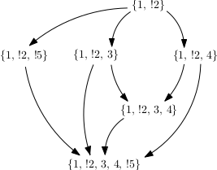
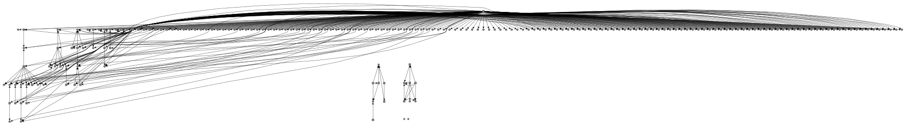
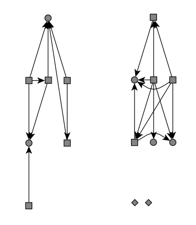
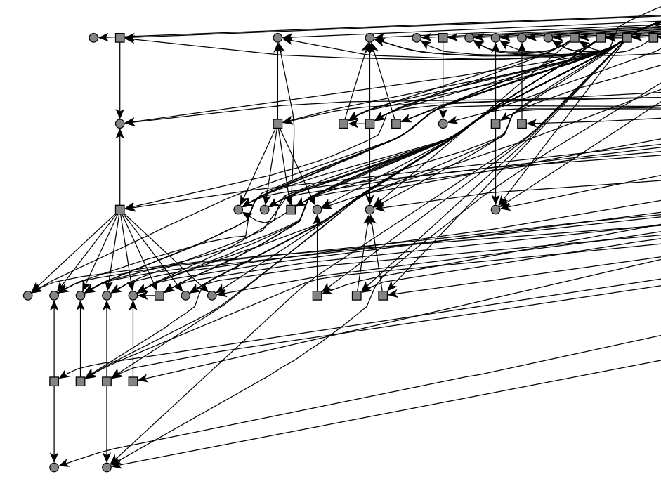
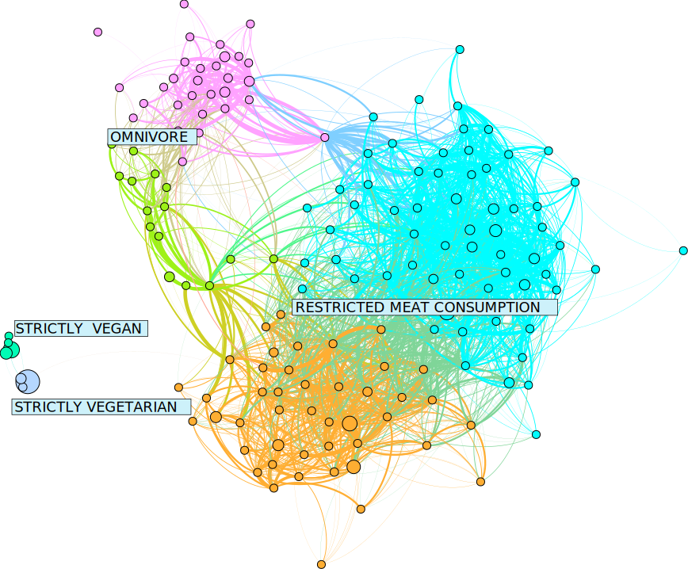

In order to group opinions into “countries”, a method to determine the “nationality” of every opinion is required. This article describes our approach to partition the vertices into so-called *clusters*, i.e. disjoint sets of vertices.  In graph-theoretic terms, the resulting  partitioning  of the vertices into clusters is known as *clustering*.   Intuitively, in a good graph clustering the vertices of the same cluster are tightly connected to each other, while the connections between the vertices belonging to different clusters are much looser. 

There is a multitude of graph clustering algorithms. And for different kinds of data, different *distance metrics* may be suitable. In an everyday understanding, 
when we think about distance, we think about the length of the shortest straight line through space between two points (the [Euclidean distance](https://en.wikipedia.org/wiki/Euclidean_distance)). Some clustering algorithms determine a fixed number of clusters on the basis of a graph embedding, taking into account only the spacial positions of the datapoints. 

## Vertex Filtering

Many graph clustering algorithms determine clusters based on the structure of the graph alone.
However, to assign the cluster membership or “nationality” to all the nodes in our opinion-graph, we take the structure of the underlying opinion data into account.
As an intermediate step, we construct another graph from our data. This graph is **not** the same as our opinion-graph, which will henceforth be referred to as the *country-graph*. This new graph, in contrast to the country-graph, is a *directed* graph. In the undirected country-graph, an edge is a set of $${u,v}$$ of two vertices. In the directed graph, an edge is an ordered pair. Typically, directed edges are visualized as arrows. The graph is constructed as follows:
Two opinions, or vertices, $$u$$ and $$v$$ are connected by an edge $$e = (u,v)$$, if the statements of opinion $$v$$ are a subset of the statements of opinion $$u$$. A minimal example could look like this:

  

The result is a *directed acyclic graph* or *DAG* for short. This means, that one cannot start at any vertex and follow a consistently-directed sequence of edges that eventually loops back to the starting vertex. 

We collected 161 opinions to draw the initial map. Drawn as a DAG constructed by the rule stated above, they look like this:

  

A closer look reveals that the graph is made up of disconnected components. There are also some *isolated* nodes (the diamond-shaped ones in the drawing).

  

The opinions that are actually drawn on the map are only the isolated nodes and the *sink* nodes of this DAG. A sink node is a node with only incoming edges (drawn as circles). *Internal* nodes (with incoming and outgoing edges) and the *source* nodes (with only outgoing edges) are drawn as rectangles. 

  

The latter two node types are considered in the map in the form of vertex weights. By default, every opinion node has a weight of $$1.0$$. If it is a non-sink node, it's weight is distributed evenly among its *children*. Also, if the same opinion is stated multiple times, a weight of $$1.0$$ is added to the corresponding vertex each time (or respectively distributed among the children, if it is a non-sink opinion). 

The sink nodes tend to be the most specific nodes, and the source nodes the most general ones. The source node in the image below is a highly general opinion, that is, most the participant suspended judgment with respect to almost every statement. 

  

[comment]: # (This is generically illustrated in \autoref{subfig:cluster}. It can be seen that vertices within each cluster, indicated by the dashed circles, are connected more densely than vertices belonging to different  clusters.)

## Edge Filtering

Initially, we collected 210 opinions, two of which where inconsistent. $$n$$ = 161 opinions where sink nodes in the DAG. We then proceeded to calculate the mutual coherence values for all pairs of opinions, yielding a *complete* graph (i.e. every vertex has an edge to every other vertex) with $$n \cdot\frac{n-1}{2} = 12880$$ edges. The edge values given by the degree of mutual coherence are real number in the range $$[-1,1]$$. However, most clustering and layouting algorithms can deal only with positive edge weights and clustering as applied here does not make sense in a complete graph since it is supposed to find a partition where the intracluster density is higher then the intercluster density. Furthermore, sparsification is necessary for reasons of performance.

Therefore we first applied **global edge filtering** by adding a constant of 0.808 to every edge weight and discarding any edge with a weight that remained negative afterwards. A constant $$> 1.0$$ turns every edge weight positive, so the closter to $$0.0$$ the constant, the more edges are filtered out. The constant of 0.808 was used because with this value, just enough edges were retained for the graph to not decompose in connected components. 

Furthermore, we applied **local edge filtering**. For every node $$v$$ the $$deg(v)^e$$ edges with the highest edge weights are marked. $$deg(v)$$ is the vertex *degree*, that is the number of edges incident to $$v$$. $$e$$ is a constant $$\in [0.0, 1.0]$$. This ensures, that for each node, at least one edge is marked. If $$e = 1.0$$, all edges are marked. Any edge that has been marked by at least one node is retained while ummarked edges are discarded.   

## Clustering

We then applied the [Infomap](http://www.mapequation.org/) clustering algorithm to the filtered country-graph. We used the free graph visualisation software [Gephi](https://gephi.org/) to test our clustering. The image below shows a visualisation rendered in Gephi. The *layout*, i.e. the arrangement of vertices and edges in the 2D plane was calculated with Gephi's inbuilt layouting algorithm *Force Atlas 2*. The colors are assigned according to the Infomap clustering.

  

As can be seen, the layout and the clustering algorithm are compatible, which is vital in order for the countries to be mostly connected. The vertex radii in this drawing are proportional to the vertex weight. The labels show the intially selected option on the survey. Vegans and vegetarians each form their own clusters. The majority of participants selected “restriced meat consumption”. These, as well as the “omnivore”-opinions where subdivided into two clusters by the algorithm. 
We performed a semantic analysis of these clusters by hand, by investigating which statements where most frequently rejected and which statements where most frequently accepted. The results are described [here]({{ site.github.url }}/menu/veggie-debate.html)

## Next Step

Creating the [graph drawing]({{ site.baseurl }})