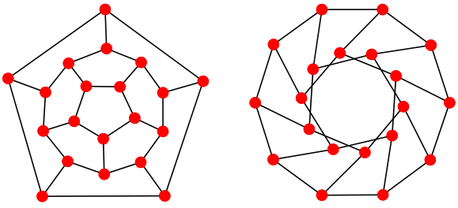
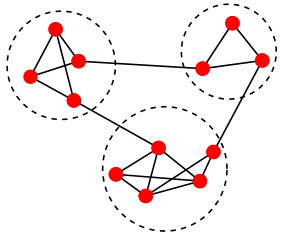
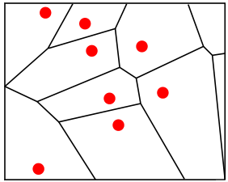

OpMAP visualizes multiple opinions as a geographic map. A location in this map represents a particular opinion, and the distance between two locations signifies the extent to which the corresponding opinions cohere with each other. The closer two opinion points in the map, the better they fit together.

The input to our mapping algorithm is a *graph*. In the graph theoretical sense, a graph (also sometimes called a *network*) is a structure that consists of a set of objects in which pairs of objects are related. The objects are called *vertices* or *nodes* of the graph and the related pairs are indicated by *edges*. In our case, the vertices correspond to opinions held within the debate. 

As described [here]({{ site.baseurl }}), we represent an opinion as a set of sentences, which are encoded as numbers. 
Hence an opinion looks for example like this: `{1, !2, 3 , 5 , !10 ...}` where `!x` means that statement `x` was rejected. 
The vertices in our graph are all sets like this one.
In order to specify the graph's edges we need some measure of *similarity* or *coherence* between two opinions, i.e. how well two opinions “hang together”. Various metrics to quantify this intuitive notion have been proposed. We use the [degree of mutual coherence]({{ site.baseurl }}). For all pairs of opinions, or vertices, the mutual coherence value is calculated. These values are real numbers in the range $$[-1,1]$$. Only if the $$Coherence(A,B)$$ of two opinions $$A$$ and $$B$$ passes a certain threshold, the two corresponding vertices are linked by an edge, which is *weighted* by that value. 

In it's full generality, the graph is edge-weighted and vertex-weighted. The vertex-weights are explained in the article on [filtering and clustering]({{ site.baseurl }}).

Now in order to obtain a map representation from the input graph, several steps are necessary. 

One step is to *embed* the graph in the 2D plane. Graphs are commonly visualized such that vertices are represented by dots and edges are represented
as lines, as it is the case in the figure below.

  

Embedding a graph basically means that vertices are associated with their corresponding dots and edges are associated with their corresponding lines. The figure shows a two different example representations of the same underlying graph, a small specimen with 20 vertices and 30 edges. In order to obtain graph embeddings there is a family of algorithms of great computational beauty, so-called Force-Directed Algorithms. They are inspired by the mechanical analogy of a mass-spring  system: Vertices in the graph can be imagined as spheres which are connected by springs. In accordance with the similarity measure the spheres are either attracted  or repelled from each other, until the system converges to a state of minimal energy. Or respectively, the drawing converges to a state in which the more similar vertices are drawn closer to each other and the more dissimilar vertices are farther apart. 

Another step is to determine the “nationality” of every opinion. This is done with the help of graph filtering and clustering algorithms. Clustering aims to assign the vertices in the graph to different groups (so-called clusters) such that vertices in the same group are more similar to each other than to those in other clusters. This is generically illustrated in the figure below. 

  

It can be seen that vertices within each cluster (indicated by the dashed circles) are connected more densely than vertices between the clusters.

The last step is the one that actually yields the map. Here we use so-called Voronoi diagrams. These diagrams divide the 2D plane into regions based on the distance to points on that plane. In our case, the vertices in the drawing. For each vertex there is a corresponding region consisting of all points closer to that vertex than to any other. 

  

Finally, the regions corresponding to nodes of the same cluster are given the same colour and we obtain our countries by merging cells of the same colour.