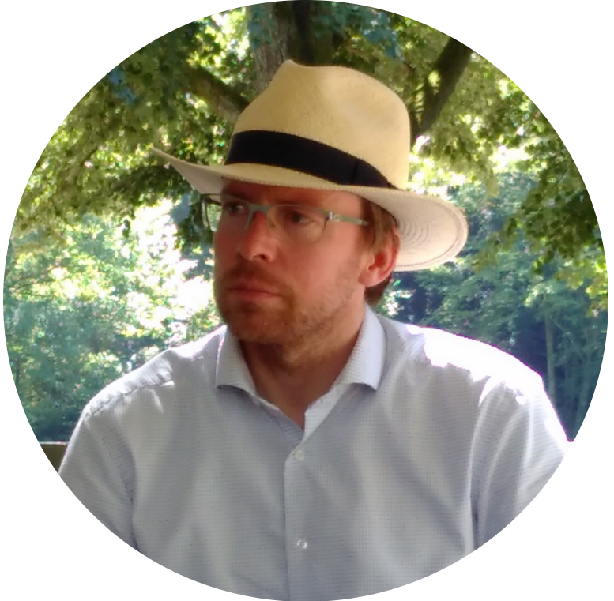

    
  <b>Gregor Betz</b>

I'm a philosopher with interests in argumentation, formal models of reasoning, and philosophy of science.

I've been studying in Berlin, Paris and London and working in Berlin and Stuttgart, before taking up my current position at the Karlsruhe Institute of Technology.

***

    
  <b>Tamara Mchedlidze</b>

I am a **computer scientist**. I am passionate about **algorithms**, **graphs** and **visualizations**.  I am a mathematician by training, thus I am used to **prove** facts about the algorithms I develop. Trying to keep in touch with reality though, I investigate how humans read and enjoy graph visualisations.

I grew up in Tbilisi, Georgia. I studied and obtained my PhD from National Technical University of Athens, Greece.  Since 2012 I live  with my husband and our little son in Karlsruhe, Germany. I work as a postdoctoral researcher at Karlsruhe Institute of Technology at the Institute of Theoretical Informatics.

***

### Past Team members
Michael Hamann
Sophie v. Schmettow
Christian Voigt

***

# Contact
If you are having any problems, any questions or suggestions, feel free to [contact OpMAP team](mailto:t.mtsentlintze@uu.nl).
