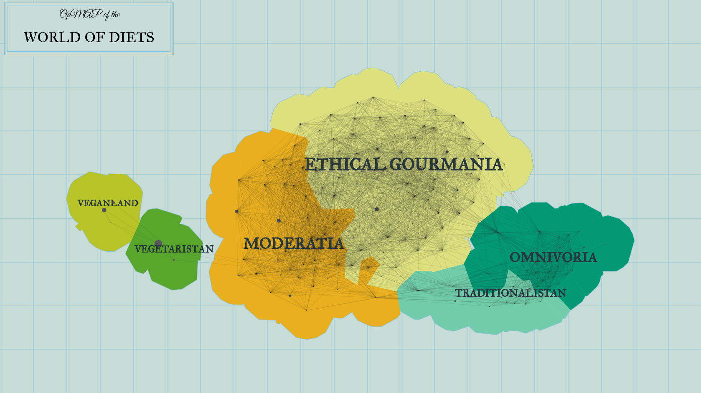
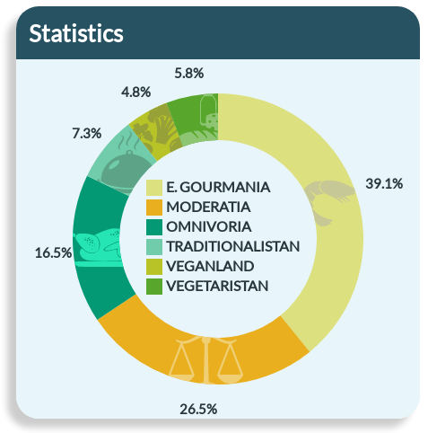

  

The analysis of the data of the debate on nutrition behaviour reveals six major countries.

  

### Ethical Gourmania

In this country, eating meat is in principle deemed permissible for reasons of taste and cultural tradition.
However, the problems of modern mass farming are also acknowledged, which explains the wide-shared belief that only meat
from sustainable and organic production may be consumed.        

### Once-A-Week-Land (aka Moderatia)

In this country, there exist a profound awareness and recognition of the diverse problems of mass farming -- ranging
from violations of animal rights in the farm to global climate change. A (possibly drastic)
reduction of meat consumption and a boycott of products from mass farming are considered to be appropriate answers to these problems.
Many even demand that the consumption of all animal products whatsoever be reduced.

### All-You-Can-(M)eat (aka Omnivoria)

In this country, meat is considered to be way too delicious to be abstained from. Animals are not recognized as beings with
a right to life. And modern mass-farming, it is believed, doesn't represent much of a problem anyway. So, in this country, you may basically
eat what you want.  

### Traditionalistan

In this country, killing and eating animals is seen as something very natural.
The traditional human diet is essentially viewed as unproblematic.
Any moral demands to change individual eating habits are rejected as paternalistic and out-of-place.

### Veganland

In this country, animal products of any kind are a no-go. In view of all the problems
of farming animals and the consumer's irreducible uncertainty about what is really going on in a farm,
a vegan diet is unanimously demanded. From a culinary point of view, the vegan cuisine is considered
as no less delicious than the traditional one.

### Vegetaristan

In this country, one must not eat meat, while other animal products may very well be consumed.
Killing animals for meat production is considered to be un-ethical. Farming animals in order to produce, e.g.,
eggs or milk, it is believed however, is not necessarily problematic. Vegetarian dishes are judged to be (at least)
as delicious and healthy as traditional ones.