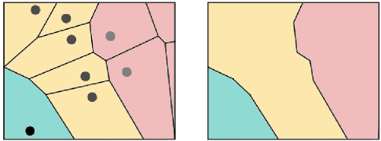

## Drawing of the Opinion Graph

A *drawing* of a graph is basically a graphical representation on the plane where the vertices are commonly drawn as dots and edges as lines, connecting the corresponding vertices. There are many ways to draw a single graph.  In order to obtain a graph drawing there is a family of algorithms of great computational beauty, so-called **Force-Directed Algorithms**. They are inspired by the mechanical analogy of a mass-spring system: Vertices in the graph can be imagined as spheres which are connected by springs. 
In accordance with the similarity measure the spheres are either attracted to or repelled from each other, until the system converges to a state of minimal energy. Or respectively, the drawing converges to a state in which the more similar vertices are drawn closer to each other and the more dissimilar vertices are farther apart. 

Our visualisation runs in a web browser and was implemented using the JavaScript data visualisation library [D3.js](https://d3js.org/). 
Several parameters of the force-directed algorithm were adapted to optimize the desired drawing properties, e.g. that country areas correspond roughly to the number of represented opinions and proximities on the map reflect semantic proximities in the data. The algorithm itself does not consider any semantic information about the data though, merely the structure of the graph, which makes it all the more fascinating.
To name a few:

**Link distance**: The target distance between pairs of nodes that are connected was set to  

$$d_{link} = \begin{cases} \frac{1}{w(e)}\cdot 0.2 &\mbox{if } e \text{ is an intracluster edge}\\ 
\frac{1}{w(e)}\cdot 3&\mbox{if } e \text{ is an intercluster edge} \end{cases}$$
 where $$w(e)$$ is the edge weight.
 We take the inverse of the edge weight because the higher the weight of an edge between two nodes, the closer they should be together in the drawing, as a higher weight indicates greater similarity. To separate the clusters or “countries” further, we use a factor of 0.2 for edges that connect two vertices which have the same cluster membership or “nationality” and a factor of 3 for edges that connect vertices with different memberships. 

**Link strength**: This parameter defines for each link, how rigidly the target link distance is enforced. It is set to

$$ \frac{1}{min(deg(u), deg(v))}$$

where $$u$$ and $$v$$ are the vertices connected by the edge, so just the inverse of the smaller vertex degree.

**Charge**: Analogous to electrical charge, this value is set for every vertex. A negative value results in repulsion, while a positive value results in node attraction. We set it to

$$-10\cdot w(v)^2 \cdot density_C$$

where $$density_C$$ is given by the number of edges within the nodes cluster divided by the number of vertices within the cluster. Recall that vertices with higher weight represent a greater number of opinions. Therefore they should take up a larger area on the map. This can be reached by giving them a greater negative charge, such that surrounding nodes are pushed apart. Also, very dense clusters with many nodes should not be pulled together too tightly, as countries with more nodes have to get a greater area. To that end, the charge is weighted by the cluster density. 

## Drawing the Map on Top

To actually create the map we use so-called **Voronoi diagrams**. These diagrams divide the 2D plane into regions based on the distance to points on that plane. In our case, the vertices in the drawing. For each vertex there is a corresponding region consisting of all points closer to that vertex than to any other. Finally, the regions corresponding to nodes of the same cluster are given the same colour and we obtain our countries by merging cells of the same colour.

  

## Next Step

Adding [dynamics]({{ site.baseurl }})